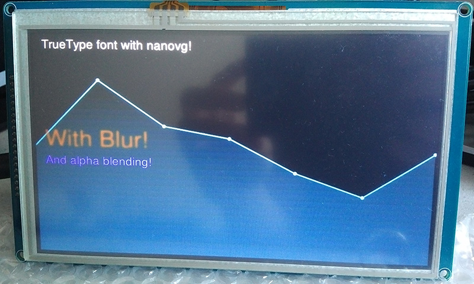
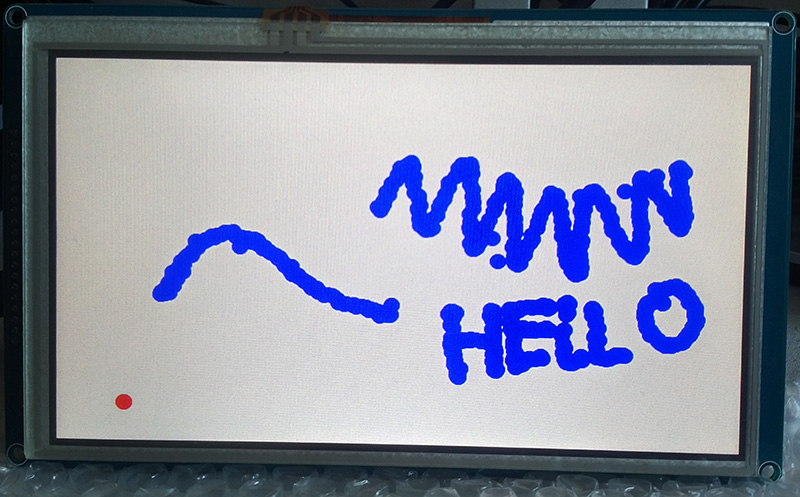
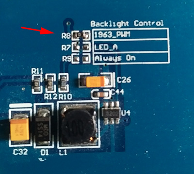

Raspberry Pi SSD1963 TFT Display with OpenGL (EGL) support including MSAA
======================


This is a driver/library for TFT LCD SSD1963 (800x480) with OpenGL support. This library uses OpenGL ES 2 for render context and uses pure EGL without any X Server or virtual framebuffers. No special drivers or special ICs are needed, the LCD is driven by GPIO only. 

The OpenGL part is based on <https://github.com/matusnovak/rpi-opengl-without-x>






## F.A.Q

**How does it work? **

First, the OpenGL ES 2 context is created using EGL (see <https://github.com/matusnovak/rpi-opengl-without-x> for more details). The context uses pixel buffer, allocated in the GPU memory. The pixel buffer is then copied into the TFT LCD. That's it!

**How is this different from PiTFT from Adafruit?**

The main difference is that PiTFT can display your desktop, as the desktop uses X Window System (See <https://en.wikipedia.org/wiki/X_Window_System>) with extra help of a virtual framebuffer. This library **can not** render your default application/games. This library is usefull only when you want to create an graphical app from scratch and you do not want to use X server or slow virtual framebuffers. PiTFT uses X Server for rendering, this library uses pure OpenGL and is super fast!

**So what is this usefull for?**

If you need to create a simple GUI for your DIY project and wish not to use X Server due to XYZ reason, this is something you might be interested in.

**What can I do with OpenGL?**

Since Raspberry Pi supports OpenGL ES 2 the limit is your imagination. 

**Is there touch screen support?**

Yes, with support of ADS7843 chip which should be right next to SSD1963 LCD driver. Note that my implementation may not be perfect! Don't tell me I did not warn you! (You can always use any other SPI driven library for ADS7843 chip). In case you want to disable touch sensor driver, or want to use a different library, you can use `TFTGL_IGNORE_TOUCH` flag when calling `tftglInit()` in order to skip SPI initialisation.

**What extra libraries do I need?**

* (needed!) bcm2835 (compatible with bcm2836) library from here: <http://www.airspayce.com/mikem/bcm2835/> See install steps section bellow!
* (only for examples) NanoVG from here: <https://github.com/memononen/nanovg> Note that I have included NanoVG in this repository as well and added a Makefile for more simple installation. See install steps section bellow!

**What Raspberry Pi is supported?**

I have tested it on Raspberry Pi Zero, but I see no reason why this would not work anywhere else.

**Which GPIO I/O do I need?**

16 for data transfer and 4 for control. See `tftgl/src/tftgl_ssd1963.h` which contains the following:

**What is the version of OpenGL used?**

OpenGL ES 2.0 (this is the limit of Raspbeery Pi)

**Can I uses this to view Raspbian desktop?**

No. This library is not using X Server, this is pure OpenGL.

**Can I play games on TFT LCD with this?**

No, unless you modify them yourself, by using EGL explicitly and copying framebuffer.

## GPIO pins

You will need to connect your Raspberry Pi with SSD display in the following way. If you need to change the GPIO pins for any reason, see `tftgl/src/tftgl_ssd1963.h` The pinout is set to Raspberry Pi Zero, which should be compatible with A+, B+, and Pi2 as well. Please refer to image: <https://www.element14.com/community/servlet/JiveServlet/previewBody/80667-102-1-338789/GPIO.png> for GPIO visualisation.

```
LCD Pin:       Raspbeery Pi GPIO:
LCD_D0     <-> GPIO 12
LCD_D1     <-> GPIO 13
LCD_D2     <-> GPIO 14
LCD_D3     <-> GPIO 15
LCD_D4     <-> GPIO 16
LCD_D5     <-> GPIO 17
LCD_D6     <-> GPIO 18
LCD_D7     <-> GPIO 19
LCD_D8     <-> GPIO 20
LCD_D9     <-> GPIO 21
LCD_D10    <-> GPIO 22
LCD_D11    <-> GPIO 23
LCD_D12    <-> GPIO 24
LCD_D13    <-> GPIO 25
LCD_D14    <-> GPIO 26
LCD_D15    <-> GPIO 27
LCD_WR     <-> GPIO 3
LCD_RS     <-> GPIO 4
LCD_CS     <-> GPIO 5
LCD_RESET  <-> GPIO 6
```

The following is needed for the touch sensor:

```
LCD Pin:       Raspbeery Pi GPIO:
T_DIN      <-> SPI MOSI (Master Out, Slave In)
T_DO       <-> SPI MISO (Master In, Slave Out)
T_CLK      <-> SPI CLK  (Clock)
T_CS       <-> SPI CS0  (Chip Select 0)
```

You can modify chip select pin, look for `#define CHIP_SELECT_PIN BCM2835_SPI_CS0` in `tftgl_ads7843.h`

## Installation

First, you will need to install the GCC compiler dependencies:

`sudo apt-get install build-essential`

Next, download and extract <http://www.airspayce.com/mikem/bcm2835/bcm2835-1.52.tar.gz> 

`wget http://www.airspayce.com/mikem/bcm2835/bcm2835-1.52.tar.gz`

`tar -xvzf bcm2835-1.52.tar.gz`

Next, clone this repository by running:

`git clone https://github.com/matusnovak/rpi-tftgl`

**Building BCM2835 library**

Go inside the bcm2835 directory that has just been extracted and run make. Don't forget to install the library!

```
cd bcm2835-1.52
make
sudo make install
```

**Building NanoVG (for examples)**

Note that I have included a copy of NanoVG and crated a simple Makefile for installation.

```
cd rpi-tftgl/nanovg
sudo make install
```

**Building tftgl library**

Same as above

```
cd rpi-tftgl/tftgl
make
sudo make install
```

## Examples

**Building examples**

Note that this needs NanoVG in order to compile examples! Also, there is no installation needed.

```
cd rpi-tftgl/tftgl/examples
make
```

There are the following examples:
* **init** - Initializes the TFT display and fills the whole display with red pixels (no OpenGL or NanoVG used)
* **triangle** - Renders a rotating triangle via GLSL shaders on the LCD and calculates the FPS
* **nano** - NanoVG example 
* **Calibrate** - Experimental example with touch support

## API Documentation

**TFT LCD common functions**

```
unsigned int tftglInit(unsigned int flags)
```

* Initializes the TFT display
* Returns `TFTGL_OK` or `TFTGL_ERROR` 
* Available flags: `TFTGL_LANDSCAPE`, `TFTGL_PORTRAIT`, `TFTGL_ROTATE_180`, `TFTGL_MSAA`, `TFTGL_IGNORE_TOUCH` . You can combine them as: `tftglInit(TFTGL_LANDSCAPE | TFTGL_MSAA);` which will initialize landscape mode with Multi sample (4 samples) anti-aliasign. The `TFTGL_IGNORE_TOUCH` will not initialize SPI driver for the touch sensor. You can use this flag if you decide to use different library to get touch sensor data.

````
void tftglTerminate()
````

* Terminates the LCD screen. Call this on application termination.

```
unsigned int tftglGetWidth()
```

* Returns the width of the LCD screen in pixels. Returns either 800 or 480 depending on which flags you have chosen in `tftglInit`

```
unsigned int tftglGetHeight()
```

* Returns the height of the LCD screen in pixels. Returns either 480 or 800 depending on which flags you have chosen in `tftglInit`

```
unsigned int tftglGetError()
```

* Returns the last error.
* Available error codes: 
  * `TFTGL_GPIO_ERROR` - GPIO not initialized! Are you running as root/sudo?
  * `TFTGL_SPI_ERROR` - SPI not initialized! Are you running as root/sudo?
  * `TFTGL_NO_DISPLAY`  - Failed to get EGL display!
  * `TFTGL_BAD_DISPLAY` - EGL display is invalid!
  * `TFTGL_BAD_CONFIG` - EGL config is invalid!
  * `TFTGL_BAD_GLAPI` - Could not bind OpenGL ES 2 to EGL!
  * `TFTGL_BAD_SURFACE` - Could not create EGL surface!
  * `TFTGL_BAD_CONTEXT` - Could not create EGL context!
  * `TFTGL_BAD_WIDTH` - LCD has invalid width!
  * `TFTGL_BAD_HEIGHT` - LCD has invalid height!
  * `TFTGL_OUT_OF_MEM` - System is out of memory!

```
const char* tftglGetErrorStr()
```

* Returns the last error as a readable string

**TFT LCD functions**

```
void tftgSetBrightness(unsigned char val)
```

* Sets the brightness of the LCD. Note that the values are from 0 (no backlight) up to 255 (max). 

* This only works if you enable PWM which might need you to move a resistor as described in the picture below:

   

```
void tftglFillPixels(unsigned int x, 
                    unsigned int y, 
	            unsigned int w, 
	            unsigned int h, 
	            const unsigned char* color)
```

* Fills the screen at x/y with size of w/h with pixels of color.
* The color parameter must be an array of 3 unsigned chars where the first index specifies red color and the last index blue color. For example `static const unsigned char color[3] = {255, 128, 0};` is a 100% red and 50% green, therefore filling the area with orange pixels.

```
void tftglGetTouchRaw(unsigned int* x, 
                      unsigned int* y, 
                      unsigned int* z)
```

* Reads the raw values of the touch sensor. Note that Z is the pressure. This will read the sensor even if no touch is present. Note that these values are raw and therefore not pixel coordinates but sensor defined coordinates that have nothing to do with pixels!

```
unsigned int tftglGetTouch(unsigned int* x, 
                           unsigned int* y)
```

* Reads the touch sensor and returns either `TFTGL_GOT_TOUCH` or `TFTGL_NO_TOUCH`. The `x` and `y` will be set to pixel coordinates. Note that this function needs proper calibration. See `tftglSetTouchCalibration()` and `calibration.c` example.

```
void tftglSetTouchSensitivity(unsigned int val)
```

* Sets the sensitivity of the touch pressure which affects `tftglGetTouch()`. You will need to experiment and find a proper value. The value is hardware specific and may differ even if two LCDs are from the same manufacturer. 

```
void tftglSetTouchCalibration(unsigned int which, 
                              unsigned int val, 
                              unsigned int pos)
```

* Sets the calibration for the touch sensor. See `calibration.c` example in the example folder for more information. The function takes a position (1D) with a `which` parameter and sets it to a value retrieved from raw touch sensor data that you have to supply. For example, the sensor might return **raw** X value of 100 if you touch the LCD on the left border and value of 5000 if you touch the LCD on the right border. You must find the raw values for specific pixels position (param `pos`) and set it to a value you got from reading raw sensor data via `tftglGetTouchRaw()`. In the `calibration.c` there are 4 points on the LCD display you will need to touch. These points have fixed pixel coordination (you can change that) and using those fixed points, and `which` flag, and raw sensor value, the calibration is set and you can then use `tftglGetTouch()` which will get you near pixel perfect touch coordinates.
* `which` can accept the following values: `TFTGL_CALIB_MIN_X`, `TFTGL_CALIB_MAX_X`, `TFTGL_CALIB_MIN_Y`, or `TFTGL_CALIB_MAX_Y`.

**EGL / OpenGL ES functions**

```
void tftglUploadFbo()
```

* Copies pixels from the back buffer (the active pixel buffer created by EGL, stored on the GPU memory) and writes them into the LCD. Note that this copies the whole 800x480 area!

```
void tftglUploadFboArea(unsigned int x, 
                        unsigned int y, 
	                unsigned int w, 
	                unsigned int h)
```

* Copies partial area of pixels of the back buffer and writes them into the LCD. You can use this to copy only areas that need updating. Usefull when rendering GUI.

```
unsigned int tftglEglMakeCurrent()
```

* Activates the OpenGL context. You can perform rendering after calling this. Note that you do not need to call this function! EGL will be automatically created when you call `tftglInit()`
* Returns either `TFTGL_OK` or `TFTGL_ERROR`

```
void tftglTerminateEgl()
```

* Terminates the EGL context. Note that you do not need to call this function! EGL will be destroyed once you call `tftglTerminate()`

```
TftglEglData* tftglGetEglData()
```

* Returns EGL specific data structure as described below. You can use this to set properties before calling `tftglInit()`. 

```
typedef struct TftglEglDataStruct {
	EGLDisplay display;
	EGLConfig config;
	EGLSurface surface;
	EGLContext context;
	int versionMajor;
	int versionMinor;
} TftglEglData;
```

* EGL data returned by `tftglGetEglData()`

  ​
